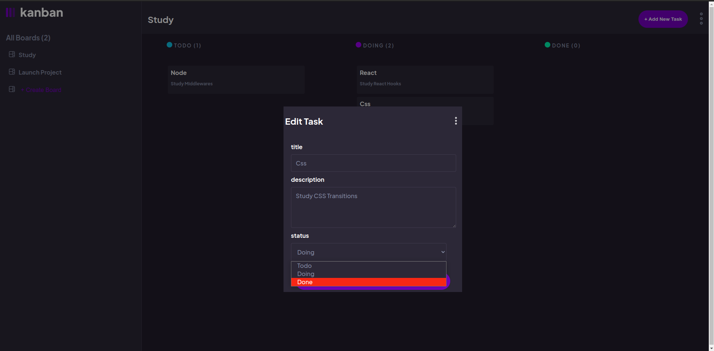

# Kanban Task Management Web App

This is an adapted version to the [Kanban task management web app challenge on Frontend Mentor](https://www.frontendmentor.io/challenges/kanban-task-management-web-app-wgQLt-HlbB).

## Overview

### The challenge

Users should be able to:

- View the layout in the desktop and tablet screen dimensions (768px, 1024px and 1440px). I haven't done the mobile design because I wouldn't use an app like this in smaller screens and I wanted to practice my React skills in this project.
- Create, read, update, and delete boards and tasks
- Keep track of any changes, even after refreshing the browser

# Screenshots

## Initial Screen

## Add Board Modal

## Add Task Modal

## Edit Board Modal

## Edit Task status

## Main Screen with Tasks and Boards

### Links

- Live Site URL: (https://fernando-kanban-app.netlify.app/)

### Built with

- Semantic HTML5 markup
- CSS custom properties
- Flexbox
- CSS Grid
- [React](https://reactjs.org/) - JS library

### What I learned

In this project I had to manage various states from different components in order to render the modals and save the state information in a way the app could manage and access that information. I challenged myself not to look at any kind of solution or way to get this project done to ensure that I could come up with a solution by myself and practice my problem-solving skills.

## Author

- LinkedIn - (https://www.linkedin.com/in/fernando-de-paula-alves-profile/)
